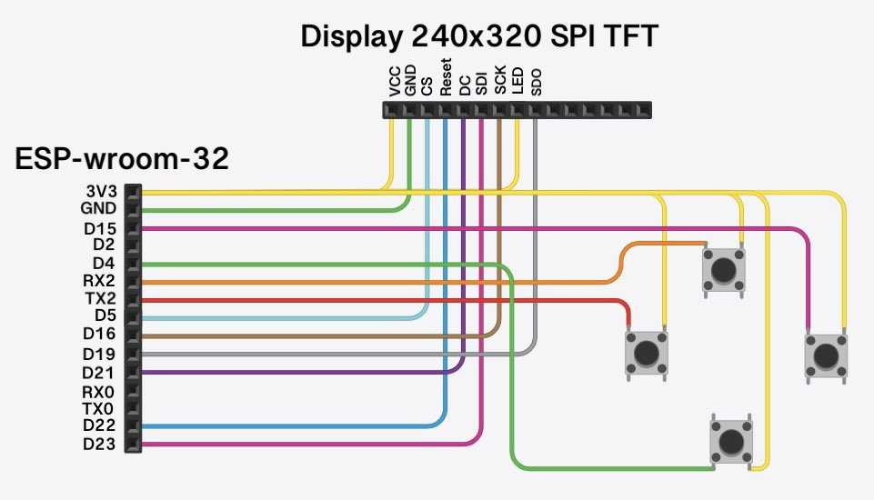

# Arduino Tetris
**Projekt zaměřen na práci s modulem ESP-WROOM-32, displayem ILI9341 a kombinací C++ s PlatformIO**

Cíl projektu je se rozvinout v oblasti programování a práce s hardwarem.

## Využité technologie:
- modul ESP-WROOM-32
- display ILI9341
- PlatformIO
- Adafruit GFX Graphics Library

## Schéma:

